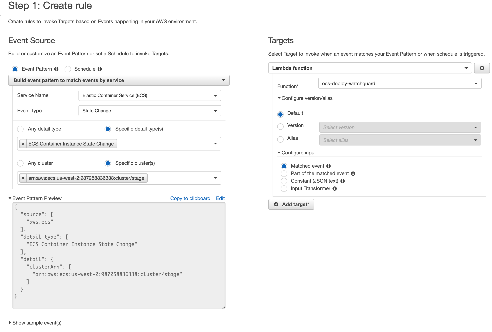

# ecs-deploy-watchguard

Post a Slack notifications to a channel when an AWS ECS task goes into the `STOPPED` status.

# Installation

1. Create a AWS Lambda function named `ecs-deploy-watchguard`. Set the basic setting timeout to something resonable like `10 seconds` from the default to allow for Slack API slowness.

2. Create a webhook in Slack and set the environment variable `SLACK_WEBHOOK_URL` in the AWS Lambda function.

3. Navigate to CloudWatch and then to `Events => Rules`. Create a new rule with the following:

