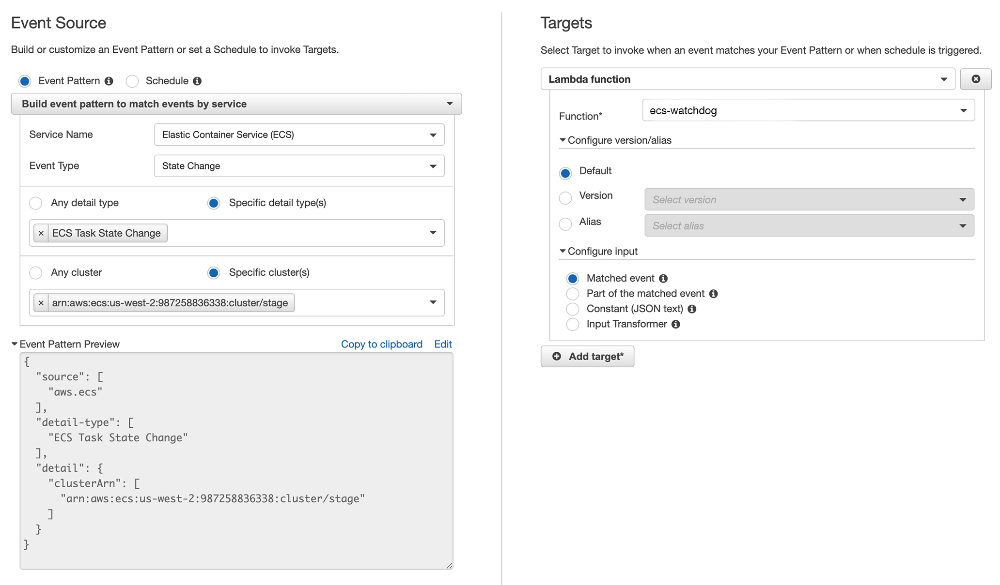

# ecs-watchdog

Post a Slack notification to a channel when an AWS ECS task goes into an unexpected `STOPPED` status.

A project by [Elastic Byte](https://elasticbyte.net). Built with :heart: in :guitar: Nashville.

## Installation

1. Create a AWS Lambda function named `ecs-watchdog` using the Node.js 12.X runtime. Set the basic setting timeout to something reasonable like `10 seconds` from the default to allow for Slack API slowness.

2. Create a webhook in Slack and set the environment variable `SLACK_WEBHOOK_URL` in the AWS Lambda function.

3. Navigate to CloudWatch and then to `Events => Rules`. Create a new rule with the following:

## Support, Bugs, And Feature Requests

Create issues here in GitHub (https://github.com/elasticbyte/ecs-watchdog/issues).

## License & Legal

Copyright 2021 [Elastic Byte](https://elasticbyte.net)

Licensed under the Apache License, Version 2.0 (the "License");
you may not use this file except in compliance with the License.
You may obtain a copy of the License at

https://www.apache.org/licenses/LICENSE-2.0

Unless required by applicable law or agreed to in writing, software
distributed under the License is distributed on an "AS IS" BASIS,
WITHOUT WARRANTIES OR CONDITIONS OF ANY KIND, either express or implied.
See the License for the specific language governing permissions and
limitations under the License.
